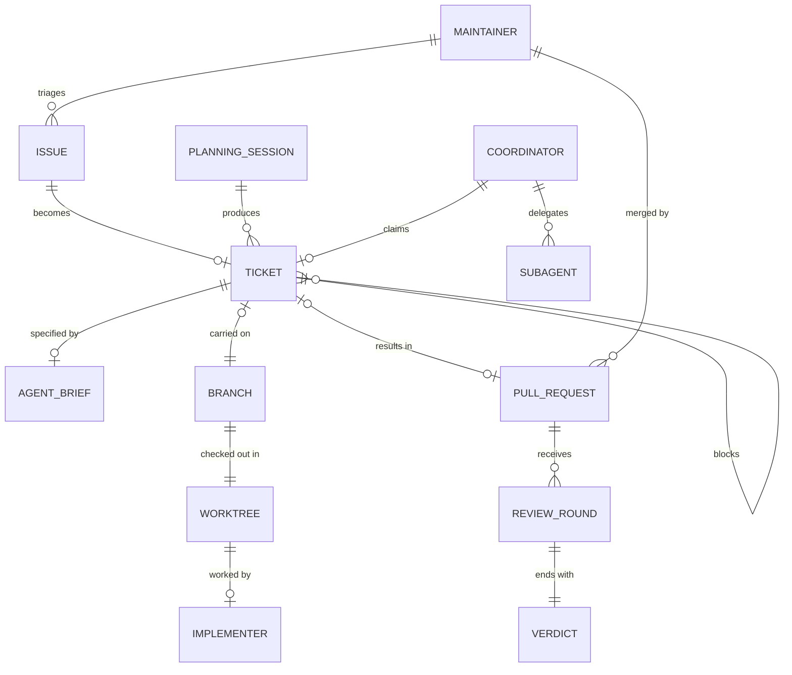

# Agent Delivery Workflow

## Scope

This ontology covers the path of one software change from tracked request to merged
result: triage, ticket readiness, coordination, delegated implementation, agent review,
escalation, and the human merge decision.

It excludes the meaning of the changes themselves (that belongs to each target
project's domain), the internals of agent runtimes and subagent mechanisms, issue-tracker
product features beyond states, labels, and assignment, and multi-maintainer
collaboration.

## Intent

Clarifies who may start, do, review, and land work; what makes a ticket safe to give to
an unattended agent; and how work returns to a human when it cannot proceed — resolving
the tension between delegating labor and keeping accountability human.

## Glossary

| Term | Definition |
| --- | --- |
| Maintainer | The human accountable for the repository; the only person who commands work to start and who merges a change. |
| Issue | A tracked unit of requested work in the project's issue tracker. |
| Ticket | An issue that has been specified and sized so an unattended agent could complete it. Every ticket is an issue; the word carries readiness. |
| Triage | Evaluating a new issue and assigning its category and state. |
| Triage state | A label expressing how far an issue has progressed toward or away from being workable (needs-triage, needs-info, ready-for-agent, ready-for-human, wontfix). |
| Planning session | A human-led working session that triages, questions, and specifies work into tickets. |
| Agent brief | The structured part of a ticket that makes it ready for an unattended agent: summary, acceptance criteria, verify commands, blocking edges, touched areas, out-of-scope, and no open questions. |
| Ready-for-agent | The triage state of a ticket whose brief is complete and whose blockers are known. |
| Readiness check | The check that verifies a ticket's brief against the brief template — every field present, no open questions, blockers declared — before the ticket becomes ready-for-agent and again before it is claimed. |
| Blocker | An open ticket that must complete before another can start. |
| Claimable | The ready-for-agent tickets that have no open blockers and no active claim. |
| Coordinator | A per-issue working session that carries one claimed ticket from claim to pull request on the maintainer's explicit command. |
| Claim | Assigning a ticket to a coordinator and marking it in progress, so no other coordinator takes it. |
| Worktree | A check-out of the repository in its own directory and branch, holding one ticket's work. |
| Branch | The line of commits carrying one ticket's change. |
| Subagent | A delegated agent session with an isolated context, given one bounded job by the coordinator. |
| Implementer | The subagent that writes and verifies a ticket's change inside the worktree. |
| Verify commands | The commands named in the agent brief whose passing defines done for the implementer. |
| Reviewer | The subagent that examines a pull request's changes and returns a verdict. |
| Verdict | The reviewer's structured outcome for one round: approve, or request changes with findings. |
| Review round | One reviewer pass and the implementer's response to its findings. |
| Pull request | The proposal to merge a ticket's branch, opened for the maintainer's review. |
| Merge gate | The rule that only the maintainer merges, after their own review of the change. |
| Escalation | Returning a ticket to the maintainer with a status comment when work cannot proceed. |

## Relationships

## Invariants

- A ticket carries the ready-for-agent state only while its brief is complete and names no open questions.
- A ticket becomes ready-for-agent only after its readiness check passes.
- A coordinator claims a ticket only after its readiness check passes.
- A ticket is claimable only while it has no open blockers and no active claim.
- A claimed ticket is never claimed by two coordinators at once.
- A coordinator works on at most one ticket at a time.
- A coordinator begins work on a ticket only at a maintainer's command.
- An implementer commits only inside its ticket's worktree and never publishes: it does not push, open pull requests, or write to the issue tracker.
- An implementer's change is done only when its ticket's verify commands pass.
- A pull request reaches the maintainer only after a review round has ended in approval.
- Only the maintainer merges a pull request.
- A reviewer's approval never substitutes for the maintainer's review.
- A branch carries exactly one ticket's change.
- Work that cannot converge within the allowed review rounds escalates instead of continuing silently.
- An escalation always leaves a status comment on the ticket.
- A closed ticket never reopens for the same change; new work is a new ticket.

## Related ontologies

- No other ontologies exist in this repository yet. The triage-state vocabulary aligns
  with the triage roles of Matt Pocock's engineering skills (see Sources).
- Wayfinder's **Frontier query** (`docs/agents/issue-tracker.md`, wrapped verbatim per
  ADR 0003) overlaps in subject matter but is a distinct, map-scoped concept that
  reuses the word; it is not this ontology's term (see ADR 0009).

## Sources

- Grilling interview with the maintainer, origin session of this repository (2026-09);
  all invariants record decisions made there.
- tenant-kit `docs/agents/triage-labels.md` — the five triage-state roles.
- Matt Pocock's `triage` and `to-tickets` skills — triage roles, blocking edges,
  tracer-bullet slicing, and the AFK-agent concept.
- pi coding agent `subagent` example extension — the Subagent and Implementer/Reviewer
  delegation concepts.
- afk-kit issue #4 and ADR 0009 — renamed Frontier to Claimable and ceded the word to
  wayfinder's frontier query.
- The workflow-state labels (`in-progress`, `in-review`) and the claim semantics are
  inferred from the maintainer's stated practice; flagged for review.
- afk-kit issue #14 and ADR 0012 — the readiness check as the form of brief
  enforcement (2026-09).
- Retired from Open questions (2026-09, after the mechanism selection, ADR 0007):
  a Claim is tracker-visible — assignment plus `in-progress`, per the issue-lifecycle
  convention's claim semantics — and the Claimable is computed on demand by a
  coordinator's frontier query, not a saved search
  (`docs/agents/issue-tracker.md`).
